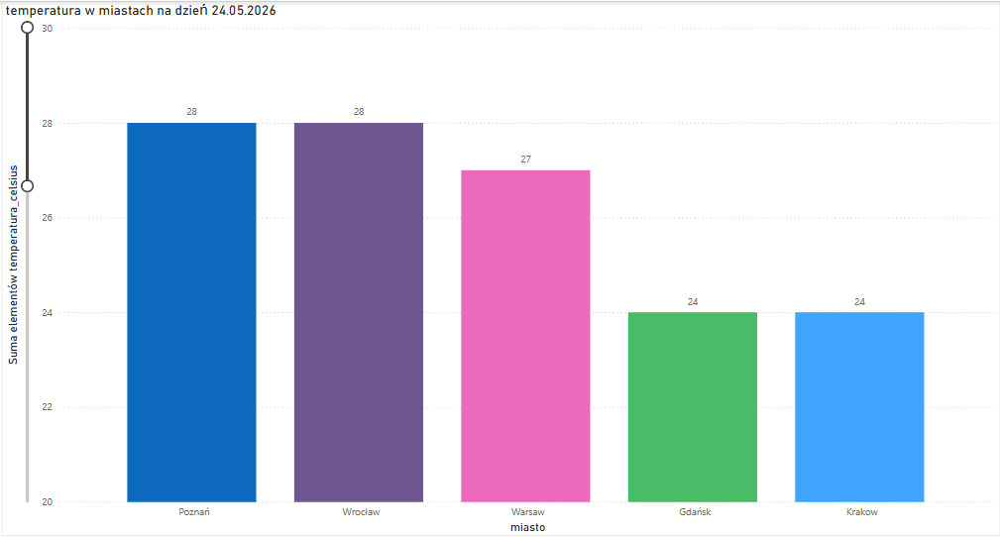

#  Weather Data Pipeline: Od API do Dashboardu

##  O projekcie
Ten projekt to w pełni działający system typu End-to-End (ETL). Służy do automatycznego pobierania surowych danych pogodowych z REST API, ich czyszczenia, trwałego zapisu oraz wizualizacji w środowisku Business Intelligence.

##  Architektura i Technologie
* **Język:** Python 3 (paczki: `requests`, `pandas`, `python-dotenv`)
* **Źródło danych:** OpenWeatherMap API
* **Baza Danych:** SQLite3
* **BI & Wizualizacja:** Power BI

##  Jak to działa 
## ⚙️ Działanie systemu (Proces ETL)

1. **Ekstrakcja danych (Extract):** Skrypt wykonuje zapytania HTTP GET do zewnętrznego interfejsu REST API (OpenWeatherMap) i pobiera bieżące dane meteorologiczne w formacie JSON dla pięciu zdefiniowanych miast.
2. **Transformacja (Transform):** Do przetwarzania danych wykorzystywana jest biblioteka `pandas`. Proces obejmuje mapowanie zmiennych oraz rzutowanie typów danych – w szczególności konwersję wartości temperatury z typu zmiennoprzecinkowego (float) na typ całkowity (integer). Standaryzacja ta eliminuje błędy parsowania w aplikacjach BI, wynikające z niezgodności separatorów dziesiętnych w ustawieniach regionalnych systemu operacyjnego.
3. **Ładowanie (Load):** Przetworzone struktury danych są zapisywane w relacyjnej bazie SQLite (plik `weather_data.db`). Równolegle system generuje płaski plik `dane_pogodowe.csv`, który pełni rolę ustandaryzowanego źródła zasilającego model danych w programie Power BI.

##  Dowód działania (Dashboard)
Poniżej znajduje się efekt końcowy – raport pogodowy zaczytany i wygenerowany bezpośrednio w Power BI na podstawie zebranych danych:
## Wizualizacja w Power BI

